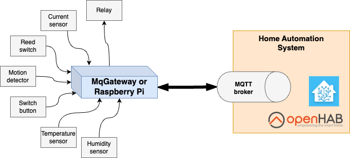

UniGateway
=========

This repository contains source code of software for [UniGateway project](https://docs.unigateway.io). 

## What is UniGateway
UniGateway is a software to control automation gateways. When installed on supported hardware, it allows you to control electronic sensors and controllers.

It is designed to be an essential building block of automation systems like the smart home solution.
UniGateway supports MQTT Homie convention and provides out-of-the-box integration with home automation software like OpenHab and Home Assistant.

Currently, you can install UniGateway on [MqGateway](https://mqgateway.com) or [Raspberry Pi](https://www.raspberrypi.com/).

## What's the use case?

Typical use case for UniGateway is a house with sensors and controllers distributed all around with wired connections.  
You can use MqGateway or Raspberry Pi to plug in simple and inexpensive devices, like relay modules, PIR motion sensors or just plain wall switches to make fully capable home automation system.



Read more in [documentation](https://unigateway.io/docs).

## Installation

See installation instructions in [the UniGateway documentation](https://unigateway.io/docs/user-guide/installation).

## Development

### Environment

- JDK 11
- MQTT broker (e.g. Mosquitto 2.0.21)

You can run Mosquitto as Docker with command:
```shell
docker run -d -p 1883:1883 --name mosquitto eclipse-mosquitto:2.0.21 mosquitto -c /mosquitto-no-auth.conf
```

### Code style

Production code is written in Kotlin.
Code style and rules are guarded by [Ktlint](https://github.com/pinterest/ktlint).

There is [.editorconfig](.editorconfig) file prepared with the formatting rules for [IntelliJ](https://www.jetbrains.com/idea/) 
which is the recommended IDE for the project.

### Running tests

```shell
./gradlew check
```

Tests use [Spock Framework](https://spockframework.org/) and are written in Groovy. 

### Running locally

It is possible to run the UniGateway on x86/x64 (non-ARM) machine with simulated I/O.
To do that, set environment variables and run with Gradle:
```shell
export MICRONAUT_ENVIRONMENTS=dev

./gradlew runShadow
```

Dev profile expects the MQTT broker to be running locally. You can run it with Docker:
```shell
docker run -d -p 1883:1883 --name mosquitto eclipse-mosquitto:2.0.21 mosquitto -c /mosquitto-no-auth.conf
```

You can check everything works properly by going to http://localhost:8080/ui

### Releasing

Create Git tag starting with "v" to release a new version (e.g. "v2.3.0").
