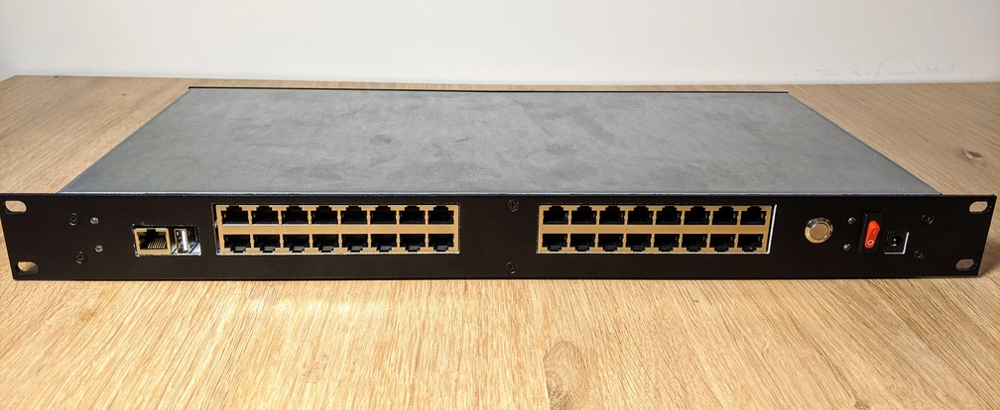
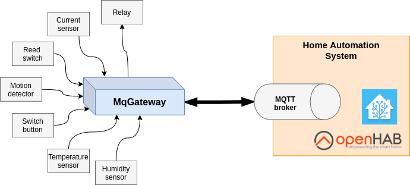

MqGateway
=========

This repository contains source code of software for [MqGateway project](https://mqgateway.com). 

## What is MqGateway
MqGateway is gateway device for multiple wired electronic sensors and controllers, which are essential in creating smart home solution.

MqGateway has been created to support multi-device, fully wired solution. MqGateway supports MQTT Homie convention and provides easy integration with home automation software like OpenHab and Home Assistant.



Both MqGateway hardware and software are freely available under Open Source Licenses.

## What's the use case?

Typical use case for MqGateway is a house with sensors and controllers distributed all around with wired connections. It is possible to plug in simple and inexpensive devices, like relay modules, PIR motion sensors or just plain wall switches into MqGateway to make fully capable home automation system.



Read more in [documentation](https://mqgateway.com).

## Installation

See installation instructions in [the MqGateway documentation](https://mqgateway.com/user-guide/installation).

## Development

### Environment

- JDK 1.8
- MQTT broker (e.g. Mosquitto 1.6.13)

You can run Mosquitto as Docker with command:
```shell
docker run -d -p 1883:1883 --name mosquitto eclipse-mosquitto:1.6.13
```

### Code style

Production code is written in Kotlin.
Code style and rules are guarded by [Ktlint](https://github.com/pinterest/ktlint).

There is [.editorconfig](.editorconfig) file prepared with the formatting rules for [IntelliJ](https://www.jetbrains.com/idea/) 
which is the recommended IDE for the project.

### Running tests

```shell
./gradlew check
```

Tests use [Spock Framework](https://spockframework.org/) and are written in Groovy. 

### Running locally

It is possible to run the MqGateway on x86/x64 (non-ARM) machine with simulated I/O.
To do that, set environment variables and run with Gradle:
```shell
export GATEWAY_SYSTEM_PLATFORM=SIMULATED
export GATEWAY_CONFIG_PATH=src/test/resources/example.gateway.yaml # optional - will use example gateway configuration from tests

./gradlew run  
```

Example configuration expects the MQTT broker to be running locally. You can run it with Docker:
```shell
docker run -d -p 1883:1883 --name mosquitto eclipse-mosquitto:1.6.13
```

### Releasing

Create Git tag starting with "v" to release a new version (e.g. "v2.3.0").
