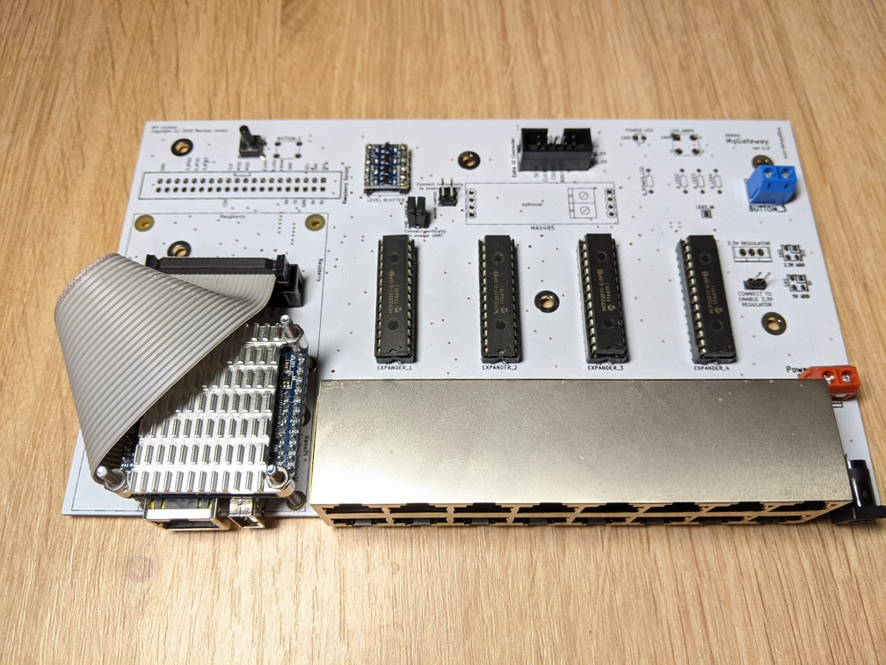
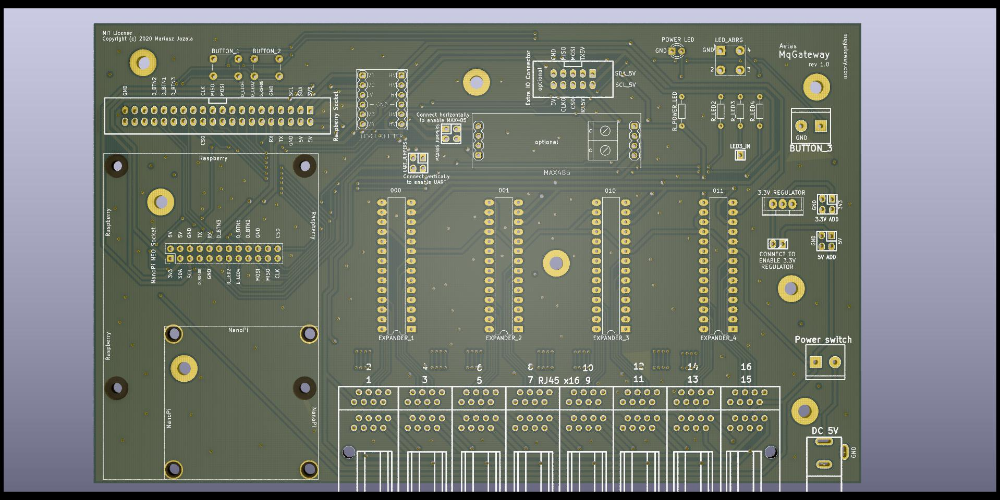

## Mainboard

### Main components

**Mainboard** is home for the key components of the device.  
The most important element is System-On-a-Chip computer (SOC) which controls other components and provides Ethernet connection. 
Four 16-channel port expanders MCP23017 has been used to supply 64 digital input/output ports. MCP23017 are connected by I2C protocol 
going through 2-way level shifter to shift 3.3V signals from SOC to 5V expanders' signals.

UART port pins from SOC also going through level shifter (3V3<->5V) can got either directly to I/O RJ45 ports or through optional MAX485 module. 
This can be set on the board with jumpers on the marked pins.  

PCB project in KiCAD and Gerber files are available on [GitHub](https://github.com/aetas/MqGateway-PCB) 
and [openhardware.io](https://www.openhardware.io/view/8242).

### I/O RJ45 ports 

Sixteen RJ45 ports are responsible for input and output to sensors and devices like relays. Each port provides:

- power (+5V and GND)
- 4 digital input/output wires
- 2 wires used for UART TTL or RS485 communication

See [wiring](wiring.md) page to learn more about RJ45 ports and role of each wire.

## Expander IO Board

An additional board which adds more input/output ports and make possible to use RS485 bus with 12V powered devices.   
**Currently in development**. 

## What's next?

- [See used components](components.md)
- [Quick start](../user-guide/quick-start.md)
- [Software installation](../user-guide/installation.md)