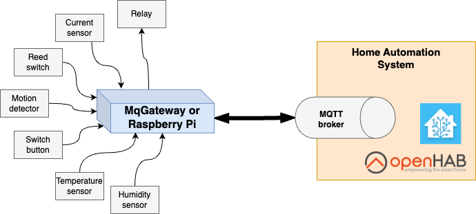

UniGateway
=========

## What is UniGateway
UniGateway is a software to control automation gateways. When installed on supported hardware, it allows you to control electronic sensors and controllers.   
It is designed to be an essential building block of automation systems like the smart home solution.

Currently, you can install UniGateway on [MqGateway](https://mqgateway.com) or [Raspberry Pi](https://www.raspberrypi.com/).

UniGateway supports MQTT Homie convention and provides out-of-the-box integration with home automation software like OpenHab and Home Assistant.

UniGateway is free to use and available with open-source license.

## What's the use case?

Typical use case for UniGateway is a house with sensors and controllers distributed all around with wired connections.  
You can use MqGateway or Raspberry Pi to plug in simple and inexpensive devices, like relay modules, PIR motion sensors or just plain wall switches to make fully capable home automation system.

## The most important features

### Hardware agnostic
UniGateway currently supports Raspberry Pi and MqGateway, but it is prepared to add support for other hardware.  

### Fully local
No cloud needed - you have a full control and don't share your data with anyone.

### Seamless integration with popular open source home automation systems
Out-of-the-box integration with Home Assistant and OpenHAB. MQTT supports allows you to integrate it with almost any of existing home automation systems.

### Advocates for wired solutions
Avoid maintenance of wireless solution, changing batteries and additional radio waves at your home.

### Flexible
Do you have single light to control? Connect relay with Raspberry Pi and start using UniGateway. It will scale with your system.
We have UniGateway system with 13 instances and hundreds of sensors in production as well.

### Support multiple devices
Unigateway already supports many devices like:

- relay,
- light,
- button/switch,
- reed switch,
- garage gate,
- roller shutter,
- temperature and humidity sensor.

See full list on [supported devices page](user-guide/supported-devices.md)  

### Compound devices support
Add two relays and two reed switches to create gate device in UniGateway and have a full control over it.  
A couple of simple devices can create complex device with simple control. 

### Extensible
UniGateway is the open solution. It is prepared to support more hardware (beside Raspberry Pi and MqGateway), easily add new controllers/sensors and implement more integrations.  
WebSocket and MQTT APIs are available to monitor and control attached devices.  

## What's next?

- [Introduction](user-guide/introduction.md)
- [Quick start on Raspberry Pi](user-guide/quick-start-raspberrypi.md)
- [Quick start on MqGateway](user-guide/quick-start-mqgateway.md)
- [Supported devices](user-guide/supported-devices.md)
- [Installation](user-guide/installation.md)
