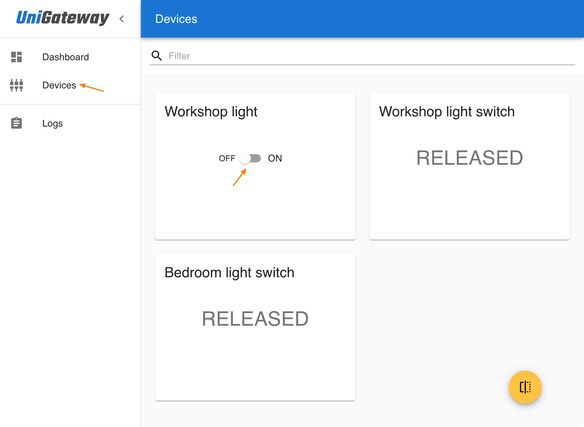

Quick start guide shows how to connect a relay module and configure MqGateway to control it. Connecting other types of devices is similar and can be done with the similar steps.  

Remember that electricity can be dangerous. You can try this guide without high voltage electricity, only with 5V power and relay module (EMR type).
This way is much safer, and you still will be able to know it works correctly, because toggling this type of relay can be easily heard.

## What do you need
- [MqGateway](https://mqgateway.com) with NanoPI NEO
- SD card (minimum 8GB) 
- Relay module (EMR) with screw connectors
- Ethernet cable (with RJ45 connector on one side only) to connect relay module

## Connect and configure device

!!! warning 
    Make sure MqGateway is never connected to power supply and micro USB port at the same time. This will destroy the device and may damage your computer.

[//]: # (TODO Test whole procedure when ready)
1. Download UniGateway SD card image for MqGateway from [here](https://github.com/unigateway/unigateway/releases/latest/download/UniGateway_SDCardImage_MqGateway.img.xz) 

2. Flash SD card with UniGateway (you can use [Balena Etcher](https://www.balena.io/etcher/))

3. Insert SD card to NanoPi NEO in MqGateway and power up MqGateway

4. Prepare ethernet cable with the connector on one side (according to standard T568B)
   [{: style="height:150px; display: block; margin: 0 auto;transform: rotate(90deg)"}](images/T568B.png)

5. Connect relay module to ethernet cable ([photo](images/relay-connected-1.jpg))

     | module pin | wire color   |
     |------------|--------------|
     | VCC/DC+    | orange       |
     | ground/DC- | orange-white |
     | control/IN | blue         |

6. Connect the module to MqGateway port number 1 ([ports](images/mqgateway-ports-numbers.jpg))
7. Open browser and go to [http://unigateway.local:8080/ui](http://unigateway.local:8080/ui)  
   _Take into account that it may take a few minutes for Unigateway to start after booting MqGateway._
8. Go to "Devices" 
9. Change the switch for "Workshop light"

State of the relay should change. You should easily hear the characteristic click of the EMR relay. You can try toggle device state for a few more 
times to check that.

Congratulation! You have just configured your first device with UniGateway on MqGateway 🎉.

## What's next?

- [What to do after installation](installation.md#after-installation)
- [Find out all supported devices](supported-devices.md)
- [Enable MQTT and Home Assistant integrations](integration.md)

  
