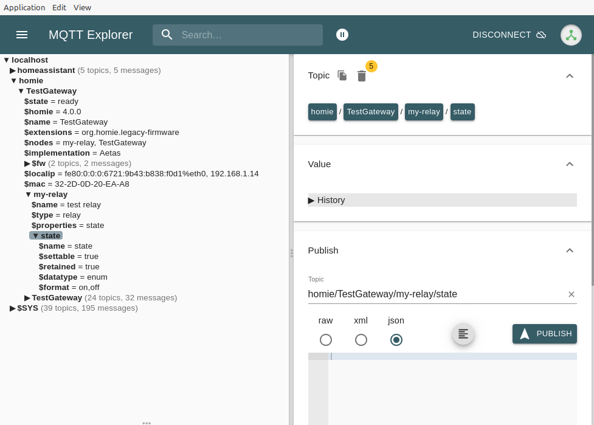
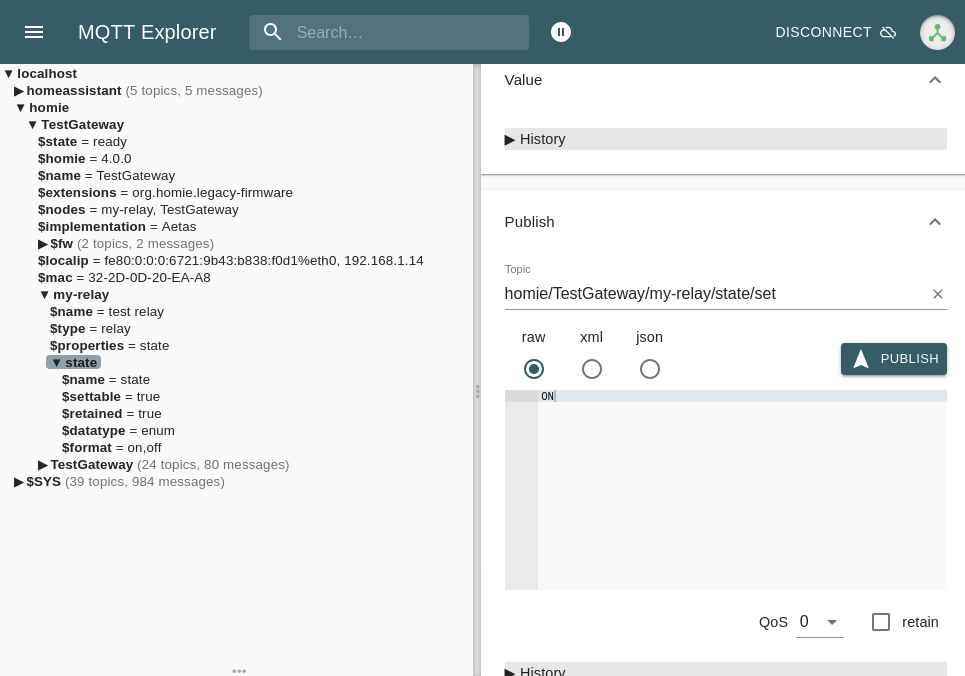

!!! info
    This quick start guide assumes you have MqGateway hardware ready. If you are looking for how to prepare the hardware - look into [hardware section](../hardware/board-layout.md).

Quick start guide shows how to connect a relay module and configure MqGateway to control it. Connecting other types of devices is similar and can be done with the similar steps.  

Remember that electricity can be dangerous. I encourage you to try this guide without high voltage electricity, only 5V power and relay module (EMR type).
This way is much safer, and you still will be able to know it works correctly, because toggling this type of relay can be easily heard. 


## What do you need
- NanoPI NEO with [Armbian](https://www.armbian.com/nanopi-neo/) installed and SSH connection established
- Assembled MqGateway with 5V power supply
- Running MQTT broker (e.g. [Mosquitto](https://mosquitto.org/))
- MQTT client installed on your computer (e.g. [MQTT Explorer](http://mqtt-explorer.com/))
- Relay module (EMR) with screw connectors
- Additional ethernet cable (with RJ45 connector on one side only) to connect relay module


## Connect and configure device

!!! warning 
    Make sure MqGateway is never connected to power supply and micro USB port at the same time. This will destroy the device and may damage your computer.

1. Connect to NanoPi NEO with SSH and run MqGateway installation script (requires root):
   ```shell
   curl https://raw.githubusercontent.com/aetas/mqgateway/master/installation-scripts/mqgateway-install.sh | sudo bash
   ```

2. Edit MqGateway configuration with an editor of your choice (e.g. nano or vim) to change address of MQTT server:

    ```yaml
    configVersion: "1.1"
    name: "TestGateway"
    mqttHostname: "192.168.1.150" # set IP of your MQTT broker
    rooms:
    - name: "workshop"
      points:
        - name: "point with test relay"
          portNumber: 1
          devices:
            - name: "test relay"
              id: "my-relay"
              wires: ["BLUE"]
              type: RELAY
    ```

    For more details on configuration files see [configuration page](configuration.md#devices-configuration).

3. Reboot your NanoPI NEO to enable I<sup>2</sup>C and serial ports.   
    MqGateway always starts automatically on start of NanoPi NEO.

4. Prepare ethernet cable with the connector on one side (according to standard T568B)
   [{: style="height:150px; display: block; margin: 0 auto;transform: rotate(90deg)"}](images/T568B.png)

5. Connect relay module to ethernet cable ([photo](images/relay-connected-1.jpg))

     | module pin | wire color   |
     |------------|--------------|
     | VCC/DC+    | orange       |
     | ground/DC- | orange-white |
     | control/IN | blue         |

6. Connect the module to MqGateway port 1 ([ports](images/mqgateway-ports-numbers.jpg))

7. On your computer - open MQTT Explorer to see device has been initialized (connect to your MQTT broker and check topics)

    If everything went right - you should see topic `homie/TestGateway/my-relay` 
    <details>
      <summary>Sample output in MQTT Explorer</summary>
      
      
    </details>

8. Send MQTT message to toggle relay state (replace IP address with your MQTT broker address)

    - Set Topic to "homie/TestGateway/my-relay/state/set"
    - Set message to "ON"
    - Press "PUBLISH"
    
    ??? note "Send with MQTT Explorer"
        

State of the relay should change. You should easily hear the characteristic click of the EMR relay. You can try to send "OFF" and "ON" for a few more 
times to check that.


Congratulation! You have just configured your first device on MqGateway 🎉.

If you have Home Assistant configured to use the same MQTT broker - new device is also available there.

## What's next?

- [Read full user guide, starting with naming conventions](naming-convention.md)
- [Find out all supported devices](supported-devices.md)

  
